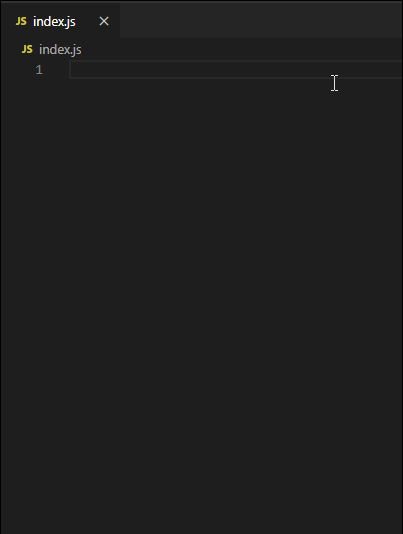
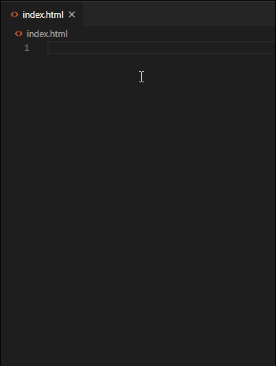
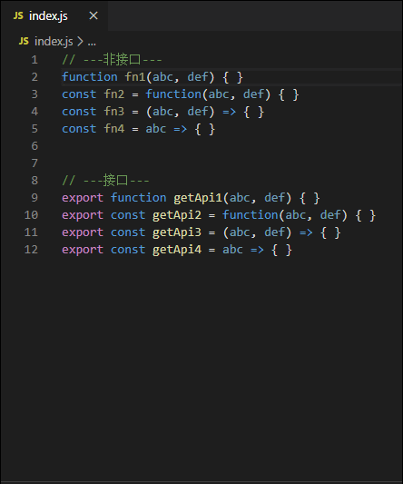

jsliang 的插件
===

> Create by **jsliang** on **2020-4-30 15:26:16**  
> Recently revised in **2020-4-30 16:29:24**

## 一 目录

**不折腾的前端，和咸鱼有什么区别**

| 目录 |
| --- | 
| [一 目录](#chapter-one) | 
| [二 前言](#chapter-two) |
| [三 功能列表](#chapter-three) |
| [四 参考文献](#chapter-four) |

## 二 前言

> [返回目录](#chapter-one)

在开发 Visio Studio Code 插件的过程中，查阅了很多插件，最让我看得舒适的是小茗同学的系列文章：

* [【博客园】小茗同学《VSCode插件开发全攻略》](https://www.cnblogs.com/liuxianan/p/vscode-plugin-overview.html)

当然，当中有一些点，因为时间差异，可能 VS Code 对此进行了变更，所以各位小伙伴自行找解决方案了。

本插件主要是为解决个人工作的一些问题而开发。

* 常用命令&网址

1. 安装 `yeoman` 脚手架工具：`npm i yo -g`
2. 安装 VS Code 代码生成器：`npm i generator-code -g`
3. 安装打包工具 `vsce`：`npm i vsce -g`
4. 新建项目：`yo code`
5. 进入开发：`Ctrl/Fn + F5`
6. 打开命令行：`Ctrl/Command + Shift + P`
7. 本地打包：`vsce package`
8. 创建 Microsoft 账号：https://login.live.com/
9. 通过 Microsoft 账号注册 Azure 账号：https://aka.ms/SignupAzureDevOps
10. 线上发布地址：https://marketplace.visualstudio.com/manage

## 三 功能列表

> [返回目录](#chapter-one)

* [x] 输入 `@fnComments` 出现 `snippets` 代码提示（用于常用代码配置）
* [x] 输入 `!!` 快速生成 H5 常用文件代码
* [x] 在功能函数或者接口函数中使用快捷键 `Ctrl/Command + Shift + I` 在 JS/JSX 文件中快速注释

### 3.1 代码：@fnComments

> [返回目录](#chapter-one)

在 JS 文件输入 `@fnComments` 插入 `snippets` 代码片段：

### 3.2 代码：!!

> [返回目录](#chapter-one)

在 HTML 文件输入 `!!` 插入 `snippets` 代码片段：

### 3.3 快捷键：Ctrl/Command + Shift + I

> [返回目录](#chapter-one)

当光标聚集于方法体的时候，使用快捷键 `Command/Ctrl + Shift + I`，会给该方法添加注释：

## 四 参考文献

> [返回目录](#chapter-one)

* 本插件开发文档：[plm-snippet 开发](https://github.com/LiangJunrong/document-library/tree/master/other-library/tool/Visio%20Studio%20Code)
* [【博客园】小茗同学《VSCode插件开发全攻略（一）概览》](https://www.cnblogs.com/liuxianan/p/vscode-plugin-overview.html)
* [【Visio Studio Code】插件市场](https://marketplace.visualstudio.com/vscode)
* [【Visio Studio Code】插件开发 API](https://code.visualstudio.com/api)

---

>  jsliang 的文档库 由 <a xmlns:cc="http://creativecommons.org/ns#" href="https://github.com/LiangJunrong/document-library" property="cc:attributionName" rel="cc:attributionURL">梁峻荣</a> 采用 <a rel="license" href="http://creativecommons.org/licenses/by-nc-sa/4.0/">知识共享 署名-非商业性使用-相同方式共享 4.0 国际 许可协议</a>进行许可。 基于<a xmlns:dct="http://purl.org/dc/terms/" href="https://github.com/LiangJunrong/document-library" rel="dct:source">https://github.com/LiangJunrong/document-library</a>上的作品创作。 本许可协议授权之外的使用权限可以从 <a xmlns:cc="http://creativecommons.org/ns#" href="https://creativecommons.org/licenses/by-nc-sa/2.5/cn/" rel="cc:morePermissions">https://creativecommons.org/licenses/by-nc-sa/2.5/cn/</a> 处获得。