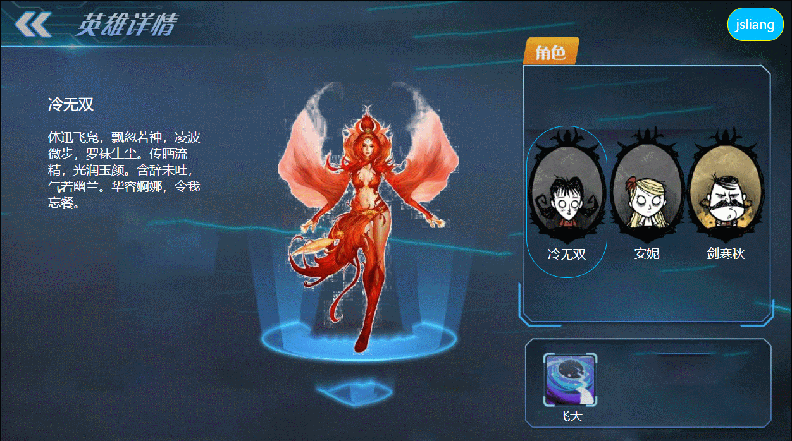

018 - 面向对象 - 英雄选择（继承）
===

> Create by **jsliang** on **2020-05-13 08:30:26**  
> Recently revised in **2020-5-13 08:55:36**  

## 一 目录

**不折腾的前端，和咸鱼有什么区别**

| 目录 |
| --- | 
| [一 目录](#chapter-one) | 
| [二 前言](#chapter-two) |
| [三 更新变化](#chapter-three) |

## 二 前言

> [返回目录](#chapter-one)

通过面向对象的形式，编写英雄选择页面。

成品展示：

## 三 更新变化

> [返回目录](#chapter-one)

想比于《016-面向对象-英雄选择》，它的更新在于：

1. 创建了基类 `Hero`
2. 所有英雄都继承于基类

同样，`skills` 目录也可以抽取，这里偷懒，就不干了~

---

**不折腾的前端，和咸鱼有什么区别！**

>  jsliang 的文档库 由 <a xmlns:cc="http://creativecommons.org/ns#" href="https://github.com/LiangJunrong/document-library" property="cc:attributionName" rel="cc:attributionURL">梁峻荣</a> 采用 <a rel="license" href="http://creativecommons.org/licenses/by-nc-sa/4.0/">知识共享 署名-非商业性使用-相同方式共享 4.0 国际 许可协议</a>进行许可。 基于<a xmlns:dct="http://purl.org/dc/terms/" href="https://github.com/LiangJunrong/document-library" rel="dct:source">https://github.com/LiangJunrong/document-library</a>上的作品创作。 本许可协议授权之外的使用权限可以从 <a xmlns:cc="http://creativecommons.org/ns#" href="https://creativecommons.org/licenses/by-nc-sa/2.5/cn/" rel="cc:morePermissions">https://creativecommons.org/licenses/by-nc-sa/2.5/cn/</a> 处获得。