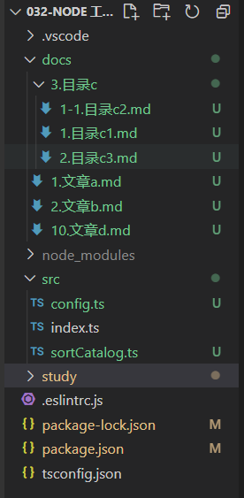
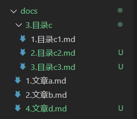

003 - commander.js
===

> Create by **jsliang** on **2021-04-23 11:33:48**  
> Recently revised in **2021-06-15 13:20:00**

——————————☆☆☆——————————

Node 系列相应地址：

* 代码仓库：https://github.com/LiangJunrong/all-for-one
* 文章仓库：https://github.com/LiangJunrong/document-library/tree/master/系列-前端资料/Node

——————————☆☆☆——————————

`commander.js` —— 完整的 `Node.js` 命令行解决方案。

本篇文章讲解如何通过 `commander.js` 溜达 Node.js 命令行。

<!-- 目录开始 -->
## <a name="chapter-one" id="chapter-one"></a>一 目录

**不折腾的前端，和咸鱼有什么区别**

| 目录 |
| --- |
| [一 目录](#chapter-one) |
| <a name="catalog-chapter-two" id="catalog-chapter-two"></a>[二 前言](#chapter-two) |
| <a name="catalog-chapter-three" id="catalog-chapter-three"></a>[三 commander.js](#chapter-three) |
| <a name="catalog-chapter-four" id="catalog-chapter-four"></a>[四 实践：文件重排功能](#chapter-four) |
| &emsp;[4.1 实践目录](#chapter-four-one) |
| &emsp;[4.2 编写 commander](#chapter-four-two) |
| &emsp;[4.3 编写排序功能](#chapter-four-three) |
| &emsp;[4.4 运行内容](#chapter-four-four) |
| <a name="catalog-chapter-five" id="catalog-chapter-five"></a>[五 常用 commander 配置](#chapter-five) |
| <a name="catalog-chapter-six" id="catalog-chapter-six"></a>[六 参考文献](#chapter-six) |
<!-- 目录结束 -->

## <a name="chapter-two" id="chapter-two"></a>二 前言

> [返回目录](#chapter-one)

当一个 `Node.js` 程序运行时，会有许多存在内存中的全局变量。

其中 `process` 作为进程对象，它有一个 `argv` 属性，可以查看到指令。

我们随便建一个 `index.js` 举例，终端执行命令：`node index.js --name jsliang`

> index.js

```js
console.log(process.argv);
/*
  [
    'C:\\Program Files\\nodejs\\node.exe',
    'F:\\jsliang\\index.js',
    '--name',
    'jsliang'
  ]
*/
```

看打印的数据：

* `Node` 位置：`C:\\Program Files\\nodejs\\node.exe`
* 当前代码路径：`F:\\jsliang\\index.js`
* 参数 1：`--name`
* 参数 2：`jsliang`

所以，在我们写命令行程序的时候，只需要对 `process.argv` 这个数组的第三个元素及其之后的参数进行解析即可。

如果不嫌麻烦，完全可以写出很多判断分支来做。

但是，有现成的为啥还要自己写，能偷懒就偷懒啊~

## <a name="chapter-three" id="chapter-three"></a>三 commander.js

> [返回目录](#chapter-one)

`commander.js` 是 `tj` 写的一个工具包，作用是让 `Node` 命令行程序的制作更加简单：

* [GitHub：commander](https://github.com/tj/commander.js)

> 懂你，中文 README 奉上：https://github.com/tj/commander.js/blob/master/Readme_zh-CN.md

下面我们开始操作：

* 初始化 `package.json`：`npm init --yes`
  * ！！【注】如果是按照 Node 系列顺序学习的，这个步骤可以省略
  * ！！【注】下面代码可以建一个 `test` 空文件夹来耍耍
* 安装包：`npm i commander`
* 编写指令文件：

> index.js

```js
const program = require('commander');

program
  .version('0.0.1')
  .description('小工具指令清单')
  .option('-s, --sort <path>', '排序功能', '')

program.parse(process.argv);
```

> package.json（自动生成）

```js
{
  "name": "test",
  "version": "1.0.0",
  "description": "",
  "main": "index.js",
  "scripts": {
    "test": "echo \"Error: no test specified\" && exit 1"
  },
  "keywords": [],
  "author": "",
  "license": "ISC",
  "dependencies": {
    "commander": "^7.2.0"
  }
}
```

这份代码的逻辑是：

1. 引用 `commander`
2. 描述 `commander` 的 `version` 等参数
3. 用 `commander` 掌控 `process.argv`

重点看看在这份代码中第 2 段的参数：

> 参数什么的看起来很烦躁，但是不了解又不知道还可以怎么用

* `version`：版本
  * 用法：`.version('x.y.z')`
* `description`：描述
  * 用法：`.description('小工具指令清单')`
* `option`：选项
  * 用法：`.option('-n, --name <name>', 'your name', 'jsliang')`
  * 第一个参数是选项定义，可以用 `|`，`,` 和 `' '` 空格连接
  * 第二个参数为选项描述
  * 第三个参数为选项参数默认值（可选）

所以下面我们可以查看到一些信息。

* 执行命令：`node index.js -h`

得到下面结果：

```
Usage: index [options]

小工具指令清单

Options:
  -V, --version           output the version number
  -s, --sort <path>       排序功能 (default: "")
  -h, --help              display help for command
```

这样我们就完成了一些小指令，那么怎么操作呢？

* 排序：`node index.js -s "jsliang"`

当然，这样感觉太怪了，能不能像日常开发一样，可以 `npm run dev`、`npm run xxx` 的方式执行？

当然是可以的！

## <a name="chapter-four" id="chapter-four"></a>四 实践：文件重排功能

> [返回目录](#chapter-one)

讲了那么多，做个小实践吧！

---

对于 Markdown 编写的文档库来说，如果你不设置文档顺序，那么它就会按照系统的规则来读取目录：

* 1.文章 1
* 10.文章 10
* 2.文章 2
* ……

当一个文件夹内容过多的时候，我们希望按照自己的顺序让用户阅读，所以不能找系统的来，因此需要用 Node 写个小工具，读取的时候按照希望的排序来读取，这就是我们开发小工具的初衷。

当然，还有个很重要的功能，就是当我们希望在第 1 篇和第 2 篇文章中间插入一篇文章的时候，例如：

* 1.文章 1
* 1-1.文章 1-1
* 2.文章 2
* ……

我们还需要将这个目录结构进行重新排序，让新文章插入到指定位置。

### <a name="chapter-four-one" id="chapter-four-one"></a>4.1 实践目录

> [返回目录](#chapter-one)

此时我们的目录为：

```
+ docs
  + 3.目录c
    - 1.目录c1.md
    - 1-1.目录c2.md
    - 2.目录c3.md
  - 1.文章a.md
  - 2.文章b.md
  - 10.文章d.md
+ src
  - config.ts
  - index.ts【已有】
  - sortCatalog.ts
- .eslintrc.js【已有】
- package.json【已有】
- tsconfig.json【已有】
```

该目录的 `.eslintrc.js`、`package-lock.json`、`package.json` 和 `tsconfig.json` 是自动创建的，TypeScript 的配置看前置文章，这里不做累述。

`docs` 目录下创建几个空 Markdown 文件，文件名照抄即可。

> 为了避免小伙伴误操作，还是截个图吧



### <a name="chapter-four-two" id="chapter-four-two"></a>4.2 编写 commander

> [返回目录](#chapter-one)

加入 `commonder` 只需要往 `package.json` 和 `index.ts` 上配置即可。

* 初始化 `package.json`：`npm init --yes`（之前已配置）
* 安装 `commander`：`npm i commander`

> package.json

```json
{
  "name": "jsliang",
  "version": "1.0.0",
  "description": "FE-util",
  "main": "index.js",
  "scripts": {
    "sort": "ts-node ./src/index.ts sort"
  },
  "keywords": [],
  "author": "",
  "license": "ISC",
  "devDependencies": {
    "@types/node": "^15.0.2",
    "@typescript-eslint/eslint-plugin": "^4.23.0",
    "@typescript-eslint/parser": "^4.23.0",
    "eslint": "^7.26.0",
    "ts-node": "^9.1.1",
    "typescript": "^4.2.4"
  },
  "dependencies": {
    "commander": "^7.2.0"
  }
}
```

> 注意 `scripts` 改变了，记得复制过去

然后简单写写 `index.ts` 里面内容

> src/index.ts

```ts
import program from 'commander';
import { sortCatalog } from './sortCatalog';

program
  .version('0.0.1')
  .description('工具库')

program
  .command('sort <path>')
  .description('文件排序功能。示例：npm run sort "docs" 或者 npm run sort " C:/code/jsliang/src/docs"')
  .action((path: string) => {
    sortCatalog(`../${path}`); // 为了更便捷，先退一层到外边
  });

program.parse(process.argv);
```

### <a name="chapter-four-three" id="chapter-four-three"></a>4.3 编写排序功能

> [返回目录](#chapter-one)

准备好基础配置之后，只需要往 `sortCatalog.ts` 里面添加内容即可：

> src/sortCatalog.ts

```js
/**
 * @name 文件排序功能
 * @time 2021-05-22 16:08:06
 * @description 规则
   1. 系统顺序 1/10/2/21/3，希望排序 1/2/3/10/21
   2. 插入文件 1/2/1-1，希望排序 1/2/3（将 1-1 变成 2，2 变成 3）
*/
import fs from 'fs';
import path from 'path';
import { IGNORE_PATH } from './config';

const recursion = (filePath: string, level = 0) => {
  const files = fs.readdirSync(filePath);

  files
    .filter((item => !IGNORE_PATH.includes(item))) // 过滤忽略文件/文件夹
    .sort((a, b) =>
      Number((a.split('.')[0]).replace('-', '.'))
      - Number((b.split('.')[0]).replace('-', '.'))
    ) // 排序文件夹
    .forEach((item, index) => { // 遍历文件夹
      // 设置旧文件名称和新文件名称
      const oldFileName = item;
      const newFileName = `${index + 1}.${oldFileName.slice(oldFileName.indexOf('.') + 1)}`;

      // 设置旧文件路径和新文件路径
      const oldPath = `${filePath}/${oldFileName}`;
      const newPath = `${filePath}/${newFileName}`;

      // 判断文件格式
      const stat = fs.statSync(oldPath);

      // 判断是文件夹还是文件
      if (stat.isFile()) {
        fs.renameSync(oldPath, newPath); // 重命名文件
      } else if (stat.isDirectory()) {
        fs.renameSync(oldPath, newPath); // 重命名文件夹
        recursion(newPath, level + 1); // 递归文件夹
      }
    });
};

export const sortCatalog = (filePath: string): boolean => {
  // 绝对路径
  if (path.isAbsolute(filePath)) {
    recursion(filePath);
  } else { // 相对路径
    recursion(path.join(__dirname, filePath));
  }

  return true;
};
```

有小伙伴看完肯定好奇 `config.ts` 是什么，其实就是全局配置而已：

```js
/**
 * @name 默认的全局配置
 * @time 2021-05-22 16:12:21
 */
import path from 'path';

// 基础目录
export const BASE_PATH = path.join(__dirname, './docs');

// 忽略目录
export const IGNORE_PATH = [
  '.vscode',
  'node_modules',
];
```

当我们没有配置的时候，就给默认的配置。

### <a name="chapter-four-four" id="chapter-four-four"></a>4.4 运行内容

> [返回目录](#chapter-one)

OK，准备完毕，就可以耍起来了。

当前 `docs` 下目录结构为：

```
- 1.文章a.md
- 10.文章d.md
- 2.文章b.md
- 3.目录c
  - 1-1.目录c2.md
  - 1.目录c1.md
  - 2.目录c3.md
```

而我们运行 `npm run sort "docs"` 后，新目录列表变成了：

```
- 1.文章a.md
- 2.文章b.md
- 3.目录c
  - 1.目录c1.md
  - 2.目录c2.md
  - 3.目录c3.md
- 4.文章d.md
```



这样，我们简单的案例就做好啦！是不是非常简单！

## <a name="chapter-five" id="chapter-five"></a>五 常用 commander 配置

> [返回目录](#chapter-one)

下面例举下我们非常不想看，但是正常使用又常见的 `commander` 配置：

* `version`：版本。用来设置命令程序的版本号
  * 用法：`.version('x.y.z')`
* `description`：描述。用来设置命令的描述
  * 用法：`.description('小工具指令清单')`
* `option`：选项。
  * 用法：`.option('-n, --name <name>', 'your name', 'jsliang')`
  * 第一个参数是选项定义，可以用 `|`，`,` 和 `' '` 空格连接，参数可以用 `<>`（必填）或者 `[]`（选填）修饰
  * 第二个参数为选项描述
  * 第三个参数为选项参数默认值（可选）
* `command`：命令
  * 用法：`.command('init <path>', 'description')`
  * `command` 用法稍微复杂，原则上接受 3 个参数，第一个为命令定义，第二个命令描述，第三个为命令辅助修饰对象
  * 第一个参数可以使用 `<>` 或者 `[]` 修饰命令参数
  * 第二个参数可选
    * 当没有第二个参数时，`commander.js` 将返回 `Command` 对象
    * 当带有第二个参数，将返回原型对象，并且没有显示调用 `action(fn)` 时，将会使用子命令模式
    * 子命令模式：`./pm`、`./pm-install`、`./pm-search` 等，这些子命令跟主命令在不同的文件中
  * 第三个参数一般不同，他可以设置是否显示使用的子命令模式
* `action`：动作。用来设置命令执行的相关回调
  * 用法：`.action(fn)`
  * `fn` 可以接受命令的参数为函数形参，顺序与 `command()` 中定义的顺序一致
* `parse`：解析 `process.argv`
  * 用法：`program.parse(process.argv)`
  * 这个 API 一般在最后调用，用来解析 `process.argv`

OK，`commander` 的简单介绍到此结束，我们下期见！

## <a name="chapter-six" id="chapter-six"></a>六 参考文献

> [返回目录](#chapter-one)

* [Github：commander](https://github.com/tj/commander.js/blob/master/Readme_zh-CN.md)
* [W3CSchool：使用commander.js做一个Nodejs命令行程序](https://www.w3cschool.cn/xhwqi/xhwqi-4hyt24se.html)

---

> jsliang 的文档库由 [梁峻荣](https://github.com/LiangJunrong) 采用 [知识共享 署名-非商业性使用-相同方式共享 4.0 国际 许可协议](http://creativecommons.org/licenses/by-nc-sa/4.0/) 进行许可。<br/>基于 [https://github.com/LiangJunrong/document-library](https://github.com/LiangJunrong/document-library) 上的作品创作。<br/>本许可协议授权之外的使用权限可以从 [https://creativecommons.org/licenses/by-nc-sa/2.5/cn/](https://creativecommons.org/licenses/by-nc-sa/2.5/cn/) 处获得。
