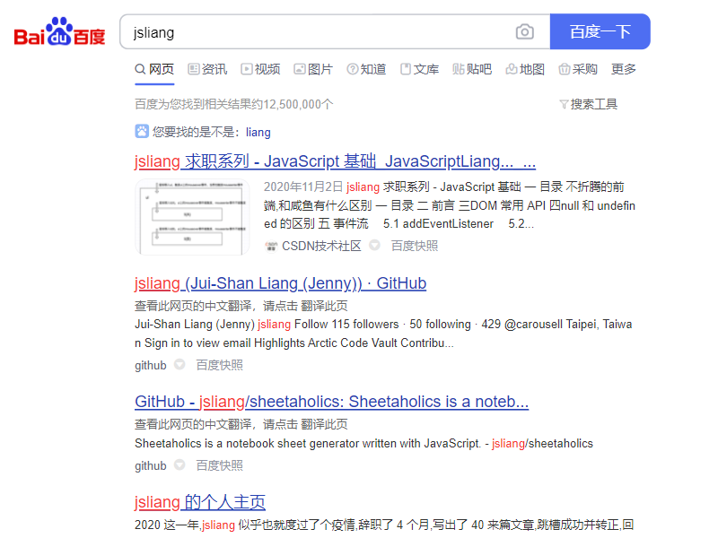
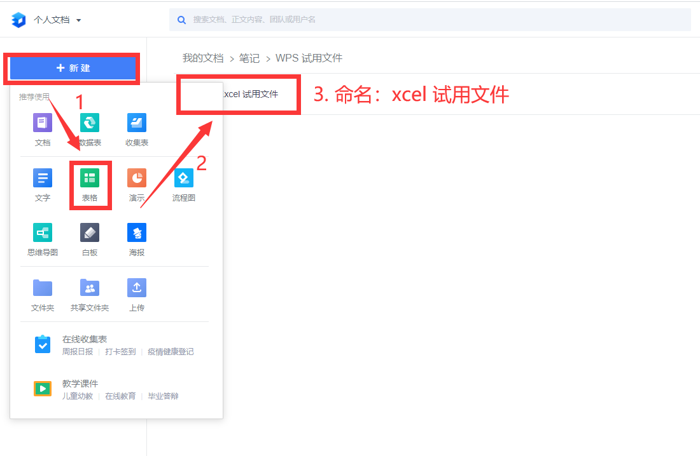
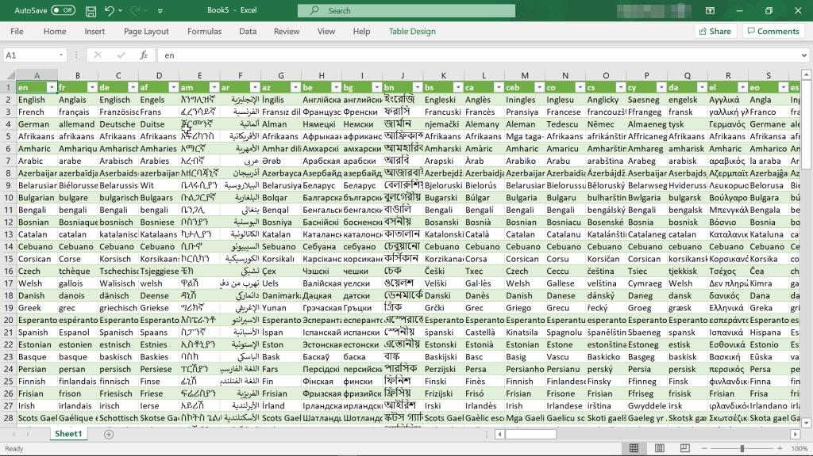
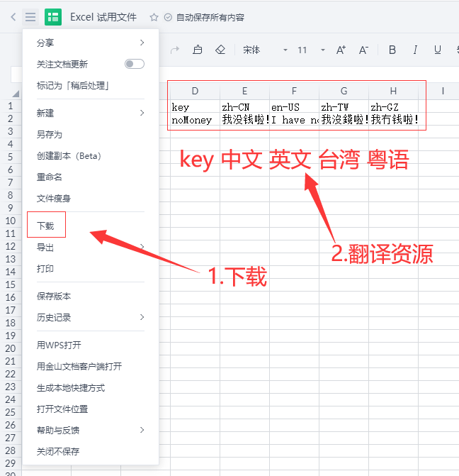
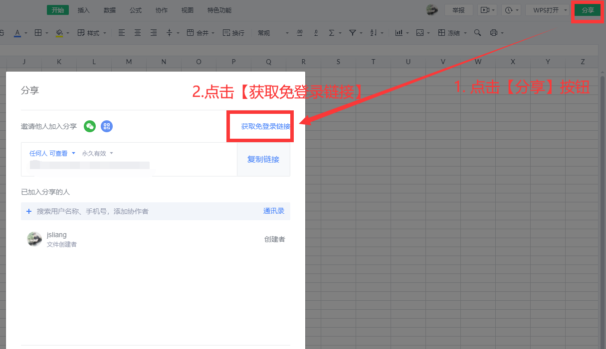
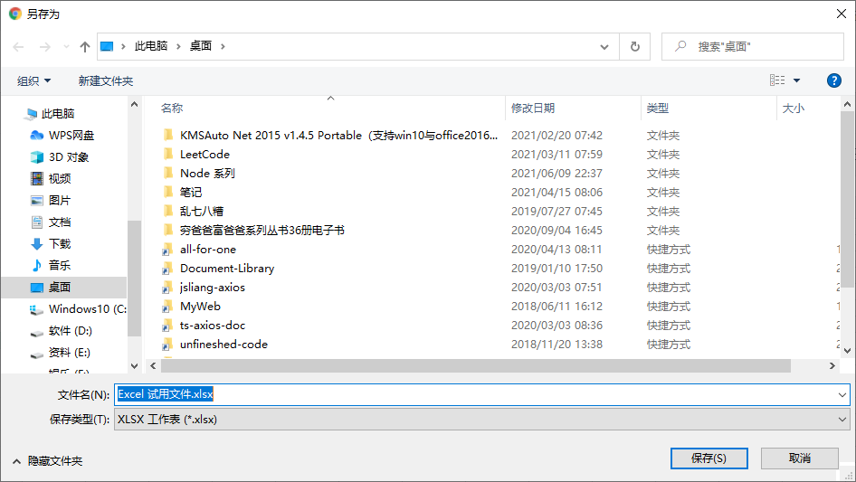

006 - Puppeteer
===

> Create by **jsliang** on **2021-06-16 22:15:56**  
> Recently revised in **2021-06-16 22:15:56**

在前面的 5 篇文章打底下，咱们应该接入点接地气的业务了。

前端多语言不知道小伙伴们有没有接触过，这一次 **jsliang** 将把真实的项目中对于多语言的处理（对，仅是处理而不是讲解多语言怎么配置）脱敏后拿出来分享下。

> 该分享所用的数据仅为参考真实项目而虚构，毕竟这只是【工具库】而不是要打造支持多语言的项目，但是这套工具修改下还是能用到其他地方的，具备参考价值

本篇文章我们将讲解如何使用 Puppeteer 控制 Chrome/Chromium。

<!-- 目录开始 -->
## <a name="chapter-one" id="chapter-one"></a>一 目录

**不折腾的前端，和咸鱼有什么区别**

| 目录 |
| --- |
| [一 目录](#chapter-one) |
| <a name="catalog-chapter-two" id="catalog-chapter-two"></a>[二 前言](#chapter-two) |
<!-- 目录结束 -->

## <a name="chapter-two" id="chapter-two"></a>二 前言

> [返回目录](#chapter-one)

Puppeteer 是一个 Node 库，它提供了一个高级 API 来通过 DevTools 协议控制 Chromium 或 Chrome。

就跟它在 GitHub 简介中介绍的一样：你在浏览器中手动执行的绝大多数操作都可以使用 Puppeteer 来完成！

* 抓取页面快照
* 生成页面 PDF
* 自动操作页面 DOM
* ……

详细例子小伙伴可以翻看本文下方参考文献的 GitHub 或者中文文档，这里不一一举例（免得被吐槽复制 README.md）

## Puppeteer

* 安装：`npm i puppeteer`

安装的时候报错：

* `(node:7584) ExperimentalWarning: The fs.promises API is experimental`

我的 Node.js 版本是 `node@10.16.0` 所以需要升级 Node.js。

注意这里有 2 种方法升级，一种是下载最新版覆盖安装，另一种是通过 `nvm/nvmw` 方式去管理。

**jsliang** 网络还不错，直接下载个最新文档版吧：[Node 官网](https://nodejs.org/zh-cn/)

查看下最新版本：

* `node -v`：`v14.17.1`

这时候再安装 Puppeteer，显示安装成功，`package.json` 显示：`"puppeteer": "^10.0.0"`

### 抓取快照

我们拿抓取页面快照做个简单举例：

> src/index.ts

```js
import program from 'commander';
import common from './common';
import './base/console';
import puppeteer from 'puppeteer';

program
  .version('0.0.1')
  .description('工具库')

program
  .command('jsliang')
  .description('jsliang 帮助指令')
  .action(() => {
    common();
  });

program
  .command('test')
  .description('测试频道')
  .action(async () => {
    // 启动浏览器
    const browser = await puppeteer.launch({
      headless: false, // 打开实体浏览器
    });

    // 创建新标签页并打开
    const page = await browser.newPage();
    await page.goto('https://www.baidu.com/s?wd=jsliang');

    // 获取快照并存储到本地
    await page.screenshot({
      path: './src/baidu.png',
    });

    // 关闭窗口
    await browser.close();
  });

program.parse(process.argv);
```

这时候 `src` 文件夹里面会出现图片文件 `baidu.png`，打开展示如下：



> 实测 科学上网工具 或者 360 安全卫士会对这操作造成影响，珍爱生命，远离不科学

这样我们就初步了解 Puppeteer 啦，当然它还可以导出 PDF 等，自行翻下文【参考文献】中的内容吧。

### 获取在线文件

既然我们可以获取到截图，那么我们能操作 DOM 也就不足为奇，咱们获取下线上的文件吧！

拿金山文档举例，咱们先创建一个 Excel 文件：



创建方式可以自己去玩玩，就不做讲解了，地址：`https://www.kdocs.cn/`

然后，我们下个环节就是需要将这个 Excel 下载下来（假设已经请人做好翻译工作了），就是这样的 Excel：



> 该图片来源于网络，本次知识分享用以参考，侵权必删

然后咱们搞个简单的吧：



> 多语言咋样不重要，咱们目的是需要操作 Puppeteer 获取到这个 Excel 文件

OK，文件有了，咱们就通过 Puppeteer 操作按钮点击来达到下载的目的吧！

现在情况是：

* 试想一下如果我们通过 Puppeteer 打开，那是无头浏览器啊，跟无痕差不多了，如果正常登录的话，需要重新登录、进入链接，然后才是点击按钮，进行下载。

所以，这里用到金山文档的免登录链接：



这里提供上面的 Demo 地址，小伙伴们可以拿来练习，但是不确保这个链接会不会哪天就被我删了，所以按照上面步骤自行设置一个吧！

* 【金山文档 Excel 试用文件.xlsx】：`https://www.kdocs.cn/l/sdwvJUKBzkK2`

---

OK，罗里吧嗦讲了那么多前置条件，下面咱们进入正题：如何获取到线下文件：

1. 操作浏览器打开 `https://www.kdocs.cn/l/sdwvJUKBzkK2`
2. 睡眠 6.66s（确保浏览器打开链接并加载页面）
3. 然后触发【更多菜单】按钮的点击
4. 睡眠 1s（确保更多菜单按钮点击到）
5. 设置下载路径（确保下载位置，要不然弹窗就不好处理）
6. 最后触发【下载】按钮的点击
7. 睡眠 1s（确保下载按钮点击到）

上面唯一要关注的点是第 5 点，因为我们 Windows 点击下载是会有弹窗的（并不是默认下载），所以需要设置好下载路径。



那么，上代码！

> src/index.ts

```js

```

## 参考文献

* [Github: Puppeteer](https://github.com/puppeteer/puppeteer)
* [Puppeteer](https://zhaoqize.github.io/puppeteer-api-zh_CN/)
* [puppeteer 前端利器](https://www.cnblogs.com/mingme/p/14013325.html)
* [Puppeteer 之爬虫入门](https://blog.fundebug.com/2017/11/01/guide-to-automating-scraping-the-web-with-js/)

---

> jsliang 的文档库由 [梁峻荣](https://github.com/LiangJunrong) 采用 [知识共享 署名-非商业性使用-相同方式共享 4.0 国际 许可协议](http://creativecommons.org/licenses/by-nc-sa/4.0/) 进行许可。<br/>基于 [https://github.com/LiangJunrong/document-library](https://github.com/LiangJunrong/document-library) 上的作品创作。<br/>本许可协议授权之外的使用权限可以从 [https://creativecommons.org/licenses/by-nc-sa/2.5/cn/](https://creativecommons.org/licenses/by-nc-sa/2.5/cn/) 处获得。
