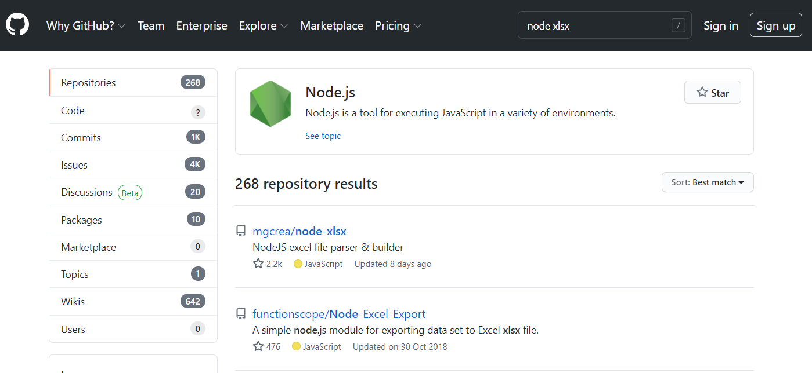
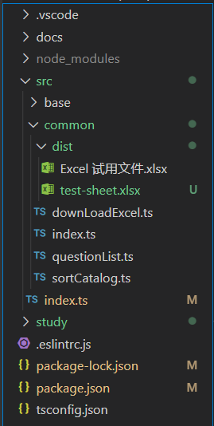
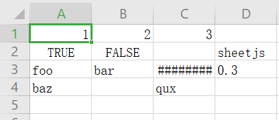
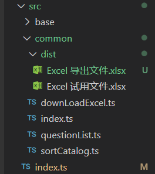
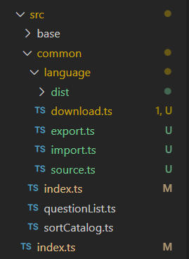

Node XLSX
===

> Create by **jsliang** on **2021-06-03 17:55:35**  
> Recently revised in **2021-06-08 09:13:33**

在通过 Puppeteer 操作浏览器下载到 Excel 之后，我们终于可以将预备将多语言的操作玩出花来了。

本篇我们将通过 `node-xlsx`，对 Excel 进行多语言导入导出的操作。

## 前言

在服务端的工作中，生成报表并送给运营、产品进行分析应该是一门简单手艺。

但是在前端中，能这样耍的机会并不多，所以多语言操作是个好玩的点（没接触过的会觉得比较新鲜）。

当然，既然服务端可以，对 Node.js 来说，提供这种功能也无可厚非。

**jsliang** 非常懒，所以直奔主题打开 GitHub：



那就第 1 个了，不要搞什么调研不调研的，对于非生产数据来说，我就是玩~

看第一行简介：`Excel file parser/builder that relies on js-xlsx.`

`js-xlsx`？这个我知道啊，在 `2021.06.03` 这一刻有 `25.7k` Star 的仓库地址：`https://github.com/SheetJS/sheetjs`

> 其实一开始试了下它关于 Node 的，enm...一时半会没入门！

但是，我还是用我的 `node-xlsx` 吧，毕竟例子都在它仓库的 README.md 贴出来了！

## 快速开始

* 安装包：`npm i node-xlsx -S`
* 安装 TypeScript：`npm i @types/node-xlsx -D`

### 测试导入

> src/index.ts

```js
import program from 'commander';
import common from './common';
import './base/console';
import xlsx from 'node-xlsx';
import fs from 'fs';

program
  .version('0.0.1')
  .description('工具库')

program
  .command('jsliang')
  .description('jsliang 帮助指令')
  .action(() => {
    common();
  });

program
  .command('test')
  .description('测试频道')
  .action(async () => {
    // 测试新功能的时候使用
    
    // 以 buffer 形式导入
    const workSheetsFromBuffer = xlsx.parse(fs.readFileSync(`${__dirname}/common/dist/Excel 试用文件.xlsx`));
    console.log(JSON.stringify(workSheetsFromBuffer, null, 2));

    // 以文件形式导入
    const workSheetsFromFile = xlsx.parse(`${__dirname}/common/dist/Excel 试用文件.xlsx`);
    console.log(JSON.stringify(workSheetsFromFile, null, 2));
  });

program.parse(process.argv);
```

执行 `npm run test`，控制台打印如下：

```js
---1---
[
  {
    "name": "Sheet1",
    "data": [
      [
        "key",
        "zh-CN",
        "en-US",
        "zh-TW",
        "zh-GZ"
      ],
      [
        "noMoney",
        "我没钱啦！",
        "I have no money",
        "我沒錢啦！",
        "我冇钱啦！"
      ]
    ]
  }
]

---2---
[
  {
    "name": "Sheet1",
    "data": [
      [
        "key",
        "zh-CN",
        "en-US",
        "zh-TW",
        "zh-GZ"
      ],
      [
        "noMoney",
        "我没钱啦！",
        "I have no money",
        "我沒錢啦！",
        "我冇钱啦！"
      ]
    ]
  }
]
```

OK，都能正常导入~

### 测试导出

```js
import program from 'commander';
import common from './common';
import './base/console';
import xlsx from 'node-xlsx';
import fs from 'fs';

program
  .version('0.0.1')
  .description('工具库')

program
  .command('jsliang')
  .description('jsliang 帮助指令')
  .action(() => {
    common();
  });

program
  .command('test')
  .description('测试频道')
  .action(async () => {
    // 测试新功能的时候使用
    
    // 导出数据
    const data = [
      [1, 2, 3],
      [true, false, null, 'sheetjs'],
      ['foo', 'bar', new Date('2014-02-19T14:30Z'), '0.3'],
      ['baz', null, 'qux'],
    ];
    const buffer = xlsx.build([{ name: "jsliang", data: data }]); // 拿到文件 buffer

    // 写入文件
    fs.writeFileSync(`${__dirname}/common/dist/test-sheet.xlsx`, Buffer.from(buffer));
  });

program.parse(process.argv);
```

执行 `npm run test` 后，目录变成：



打开这个 Excel 文件，可以看到：



好的，导出也 OK 了~

### 测试定制宽度

当然，有时候产品非常懒，需要我们将表格宽度给做好成每一列都能宽一点，那就要定制下页面宽度：

> index.ts

```js
import program from 'commander';
import common from './common';
import './base/console';
import xlsx from 'node-xlsx';
import fs from 'fs';

program
  .version('0.0.1')
  .description('工具库')

program
  .command('jsliang')
  .description('jsliang 帮助指令')
  .action(() => {
    common();
  });

program
  .command('test')
  .description('测试频道')
  .action(async () => {
    // 测试新功能的时候使用
    
    // 导出数据
    const data = [
      ['key', 'zh-CN', 'en-US', 'zh-TW', 'zh-GZ'],
      ['noMoney', '我没钱啦！', 'I have no money', '我沒錢啦！', '我冇钱啦！'],
    ];
    // 列宽设置
    const options = {
      '!cols': [
        { wch: 10 },
        { wch: 15 },
        { wch: 15 },
        { wch: 15 },
        { wch: 15 },
      ]
    }
    // 生成 buffer
    const buffer = xlsx.build([{ name: "jsliang", data: data }], options); // 拿到文件 buffer

    // 写入文件
    fs.writeFileSync(`${__dirname}/common/dist/Excel 导出文件.xlsx`, Buffer.from(buffer));
  });

program.parse(process.argv);
```

执行 `npm run test`，看到 `dist` 目录生成：



然后点开「Excel 导出文件.xlsx」，里面内容为：


安逸，满屏飘满 no money~

## 多语言操作

在我们简单了解 `node-xlsx` 之后，我们就可以通过它完成多语言的导入导出，以及下一章会讲解如何获取需要的资源。

### 导入

接「006 - Puppeteer」，我们在上一篇文章已经完成了资源的下载，实际上我们应该一条龙服务，从下载到导入统统给安排了。

那么，我们当前的目录需要改造一番：

```
- src
  + base
  - common
    - language
      + dist
      - download.ts
      - export.ts
      - import.ts
      - source.ts
    - index.ts
    - questionList.ts
    - sortCatalog.ts
  - index.ts
```

文字目录好像没那么清晰，还是贴个图吧：



那么，开始写代码：

> questionList.ts - 先明确自己的提问路线

```js
TODO:
```

> index.ts

```js
TODO: index.ts 记得将导入和导出的提问都写好，下面就不需要写了
```

> import.ts

```js
TODO:
```

> export.ts

```js
TODO: 简单写个导出方法，具体实现逻辑放后面
```

编写完毕，执行 `npm run jsliang`，按照提问逐个回车：


然后代码跑起来（姿势很帅），成功导入：


这样导入流程就完毕了。

### 导出

导入尚且如此，导出就更轻松了：

> export.ts

```js

```

执行 `npm run jsliang`，按流程点点：


然后就看下 `dist` 目录有没有对应的文件：


在打开文件看看：


OK，搞定，收工~

TODO: 能不能自动上传呢？

## 后续

那么，Excel 的操作流程我们就安排得明明白白了，下一章我们会讲解多语言机翻（机器自动翻译）和人工翻译问题的解决，从而完成多语言处理。

再在后面，也就是下下章，**jsliang** 可能开启 Node 服务，完成简单网站的搭建，不过 **jsliang** 于 2018 年写过一篇 Node 从 0 基础到企业官网了，所以咱们尝试搞个小游戏吧，嘿嘿~

## 参考文献

* [nodejs 实现导出 excel 报表](https://cloud.tencent.com/developer/article/1653844)
* [GitHub：SheetJS](https://github.com/SheetJS/sheetjs)
* [GitHub：node-xlsx](https://github.com/mgcrea/node-xlsx)

---

> jsliang 的文档库由 [梁峻荣](https://github.com/LiangJunrong) 采用 [知识共享 署名-非商业性使用-相同方式共享 4.0 国际 许可协议](http://creativecommons.org/licenses/by-nc-sa/4.0/) 进行许可。<br/>基于 [https://github.com/LiangJunrong/document-library](https://github.com/LiangJunrong/document-library) 上的作品创作。<br/>本许可协议授权之外的使用权限可以从 [https://creativecommons.org/licenses/by-nc-sa/2.5/cn/](https://creativecommons.org/licenses/by-nc-sa/2.5/cn/) 处获得。
