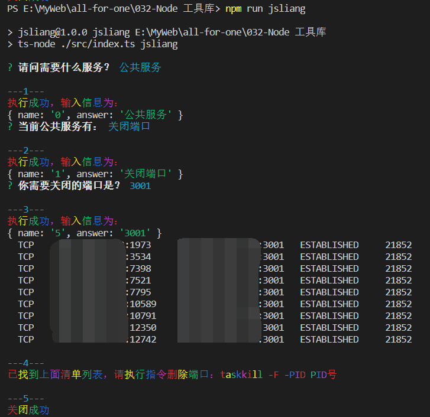
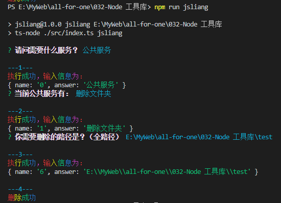

008 - ShellJS
===

> Create by **jsliang** on **2021-07-20 20:40:58**  
> Recently revised in **2021-07-20 20:40:58**

<!-- 目录开始 -->
## <a name="chapter-one" id="chapter-one"></a>一 目录

**不折腾的前端，和咸鱼有什么区别**

| 目录 |
| --- |
| [一 目录](#chapter-one) |
| <a name="catalog-chapter-two" id="catalog-chapter-two"></a>[二 前言](#chapter-two) |
<!-- 目录结束 -->

## <a name="chapter-two" id="chapter-two"></a>二 前言

> [返回目录](#chapter-one)

今天 **jsliang** 在工作中又爽了一把，开通了 VIP 通道：

1. 自动下载 Excel 文件
2. 拷贝到指定目录
3. 执行多语言导入操作
4. 将导入的资源 `git push` 上去

虽然看上去粗略的操作是这样，没有什么可讲的。

但是在操作中的时候，可能就比较繁琐了，例如单单导入资源后，进行的 `git` 操作：

1. 添加暂存区：`git add .`
2. 切换分支：`git checkout -b <branch>`
3. 提交本地版本库：`git commit -m "feat: 「多语言」新资源 #master_0720"`
4. 提交远程分支：`git push --set-upstream origin <branch>`

当然，不仅仅是这个，你提交前肯定还得校验下你的多语言资源添加完后，构建是否能顺利通过……

---

所以，叨了那么多，其实单纯是为了引出 `bash` 指令的操作。

在工作中，你可能会碰到：

* Git 系列操作
* 关闭被占用的系统端口
* 删除指定文件/文件夹等
* ……

但是，对于这些操作你可能一时半会又忘记它的指令，或者它的指令太繁琐了，所以 **jsliang** 觉得将这些内容装起来，岂不省事？

## Node 编写 bash 脚本的解决方案

其实关于这个解决方案，**jsliang** 还是嫌麻烦，所以直接上了 `ShellJS`：

* [ShellJS - Unix shell commands for Node.js](https://github.com/shelljs/shelljs)

如果小伙伴觉得这样直接上方案有点唐突，希望有个参考对比，可以看：

* [Node.js 写 bash 脚本终极方案](https://juejin.cn/post/6979989936137043999)

作者比对了 Node 自带的 `child_process` API、`ShellJS` 和 `zx`，最终采取了 `zx` 的方案。

当然，**jsliang** 工作中用的还是 `ShellJS`，不想再探索同类库了，所以就安装 `ShellJS` 吧~

* 安装：`npm i shelljs`
* 安装 TS 编译：`npm i @types/shelljs -D`

安装完毕，开始折腾！

## 关闭端口

在起一些神奇的服务时，会碰到端口被占用的场景，这时候就需要关闭端口：

* 查看端口占用情况：`netstat -ano|findstr "端口号"`

```
PS F:\xxx> netstat -ano|findstr "3001"
  TCP    0.0.0.0:3001           0.0.0.0:0              LISTENING       33396
  TCP    10.13.144.170:63001    183.2.199.241:443      ESTABLISHED     28228
  TCP    [::]:3001              [::]:0                 LISTENING       33396
```

* 终止 PID：`taskkill -F -PID PID号`

```
PS F:\xxx> taskkill -F -PID 33396
成功: 已终止 PID 为 33396 的进程。
```

那么到了 Node 工具库这边，肯定就不要自己去这样操作啦，搞个省事的方式吧：

> src/common/index.ts

```js
import { inquirer } from '../base/inquirer';
import { Result } from '../base/interface';

// 系统操作
import { sortCatalog } from './sortCatalog';

// 多语言
import { downLoadExcel } from './language/download';
import { importLanguage } from './language/import';
import { exportLanguage } from './language/export';

// shell 操作
import { closePort } from '../base/shell/closePort';

// 问题记录器
const answers = {
  q0: '',
  q1: '',
  q2: '',
  q3: '',
  q4: '',
  q5: '',
};

const common = (): void => {
  // 问题路线：看 questionList.ts
  const questionList = [
    // q0
    {
      type: 'list',
      message: '请问需要什么服务？',
      choices: ['公共服务', '多语言'],
    },
    // q1
    {
      type: 'list',
      message: '当前公共服务有：',
      choices: ['文件排序', '关闭端口'],
    },
    // q2
    {
      type: 'input',
      message: '需要排序的文件夹为？（绝对路径）',
    },
    // q3
    {
      type: 'list',
      message: '请问多语言需要什么支持？',
      choices: [
        '下载多语言资源',
        '导入多语言资源',
        '导出多语言资源',
      ],
    },
    // q4
    {
      type: 'input',
      message: '资源下载地址（HTTP）？',
      default: 'https://www.kdocs.cn/l/sdwvJUKBzkK2',
    },
    // q5
    {
      type: 'input',
      message: '你需要关闭的端口是？',
    }
  ];

  const answerList = [
    // q0 - 请问需要什么服务？
    async (result: Result, questions: any) => {
      answers.q0 = result.answer;
      switch (result.answer) {
        case '公共服务':
          questions[1]();
          break;
        case '多语言':
          questions[3]();
          break;
        default: break;
      }
    },
    // q1 - 当前公共服务有：
    async (result: Result, questions: any) => {
      answers.q1 = result.answer;
      switch (result.answer) {
        case '文件排序': questions[2](); break;
        case '关闭端口': questions[5](); break;
        default: break;
      }
    },
    // q2 - 需要排序的文件夹为？（绝对路径）
    async (result: Result, _questions: any, prompts: any) => {
      answers.q2 = result.answer;
      const sortResult = await sortCatalog(result.answer);
      if (sortResult) {
        console.log('排序成功！');
        prompts.complete();
      }
    },
    // q3 - 请问多语言需要什么支持？
    async (result: Result, questions: any, prompts: any) => {
      answers.q3 = result.answer;
      switch (result.answer) {
        case '下载多语言资源':
        case '导入多语言资源':
          questions[4]();
          break;
        case '导出多语言资源':
          const exportResult = await exportLanguage();
          if (exportResult) {
            console.log('导出成功！');
            prompts.complete();
          }
        default: break;
      }
    },
    // q4 - 资源下载地址（HTTP）？
    async (result: Result) => {
      answers.q4 = result.answer;
      const download = async (): Promise<any> => {
        const downloadResult = await downLoadExcel(result.answer);
        if (downloadResult) {
          console.log('下载成功！');
          return true;
        }
      };
      switch (answers.q3) {
        case '下载多语言资源':
          await download();
          break;
        case '导入多语言资源':
          await download();
          const importResult = await importLanguage();
          if (importResult) {
            console.log('导入完毕！');
          }
        default:
          break;
      }
    },
    // q5 - 你需要关闭的端口是？
    async (result: Result, _questions: any, prompts: any) => {
      answers.q5 = result.answer;
      const closeResult = await closePort(result.answer);
      if (closeResult) {
        console.log('关闭成功');
        prompts.complate();
      }
    }
  ];

  inquirer(questionList, answerList);
};

export default common;

```

> src/common/index.ts

```diff
// common 板块的问题咨询路线
export const questionList = {
  '公共服务': { // q0
    '文件排序': { // q1
      '需要排序的文件夹': 'Work 工作', // q2
    },
+   '关闭端口': { // q1
+     '需要关闭的端口': 'Work 工作', // q5
+   }
  },
  '多语言': { // q0
    '下载多语言资源': { // q3
      '下载地址': 'Work 工作', // q4
    },
    '导入多语言资源': { // q3
      '下载地址': 'Work 工作', // q4
    },
    '导出多语言资源': { // q3
      '导出全量资源': 'Work 工作',
      '导出单门资源': 'Work 工作',
    }
  },
};
```

> src/base/shell/closePort.ts

> shell 目录是新增的

```js
import shell from 'shelljs';

export const closePort = async (port: string): Promise<boolean> => {
  await shell.exec(`netstat -ano | findstr :${port}`);

  // Windows 下会返回一个端口占用清单，需要自行删除
  console.log('已找到上面清单列表，请执行指令删除端口：taskkill -F -PID PID号'); 

  return await true;
};
```

> 注：Windows 打印结果最末尾的为 PID 号

当然，因为 `3001` 可能会有好几个 `ip` 对应的端口，所以后面那个步骤我们仅做了提示，而不是关闭了所有 `3001` 的端口（需要用户手动操作）。

但是这样总好过我们去记忆这个指令（毕竟 Windows 和 Mac 等的操作指令还不通）

执行 `npm run jsliang`，运行结果如下：



这样我们就封装好了关闭端口的，因为不是一键彻底关闭，实用指数给到 ☆☆☆

## 删除文件/文件夹

为了研究 Windows 如何快速删除 `node_modules`，**jsliang** 还真研究了 3 种删除文件/文件夹的方式：

1. `cmd.exe`：`rd /s /q <path>`
2. `PowerShell`：`rd -r <path>`
3. `Mac`：`rm -rf <path>`

经过多次亲身体验，在公司中的 32G 内存，500 SSD 的台式电脑中，通过 `PowerShell` 的删除操作比 `cmd.exe` 的快（别问我为啥，反正就是快点，仅个人体验，不做科学支撑）。

然后看了下 `ShellJS`，是有删除方式的：

* ShellJS：`rm()` 删除文件，`rm('rf', <path>)` 删除文件夹

当然！奔着探索精神，咱们看看它源码咋实现的：

* [GitHub：ShellJS - rm.js](https://github.com/shelljs/shelljs/blob/master/src/rm.js)

```js
function rmdirSyncRecursive(dir, force, fromSymlink) {
  
  // 1. 先删除目录中的所有文件
  let files = fs.readdirSync(dir);
  for (var i = 0; i < files.length; i++) {
    // 1.1 如果是目录则递归调用 rmdirSyncRecursive()
    // 1.2 如果是文件则调用 fs.unlinkSync() 执行删除
  }

  // 2. 再删除目录
  fs.rmdirSync();
}
```

当然，里面有些细节还是写得不错的，这里就不展开详细讲解。

所以，咱们就用 `ShellJS` 的方法吧！如果后面感觉不舒服再替换为系统指令。

> src/common/index.ts

```js
import { inquirer } from '../base/inquirer';
import { Result } from '../base/interface';

// 系统操作
import { sortCatalog } from './sortCatalog'; // TODO: 迁移到 file 文件夹
import { deleteDir } from '../base/file/deleteDir';

// 多语言
import { downLoadExcel } from './language/download';
import { importLanguage } from './language/import';
import { exportLanguage } from './language/export';

// shell 操作
import { closePort } from '../base/shell/closePort';

// 问题记录器
const answers = {
  q0: '',
  q1: '',
  q2: '',
  q3: '',
  q4: '',
  q5: '',
  q6: '',
};

const common = (): void => {
  // 问题路线：看 questionList.ts
  const questionList = [
    // q0
    {
      type: 'list',
      message: '请问需要什么服务？',
      choices: ['公共服务', '多语言'],
    },
    // q1
    {
      type: 'list',
      message: '当前公共服务有：',
      choices: ['文件排序', '关闭端口', '删除文件夹'],
    },
    // q2
    {
      type: 'input',
      message: '需要排序的文件夹为？（绝对路径）',
    },
    // q3
    {
      type: 'list',
      message: '请问多语言需要什么支持？',
      choices: [
        '下载多语言资源',
        '导入多语言资源',
        '导出多语言资源',
      ],
    },
    // q4
    {
      type: 'input',
      message: '资源下载地址（HTTP）？',
      default: 'https://www.kdocs.cn/l/sdwvJUKBzkK2',
    },
    // q5
    {
      type: 'input',
      message: '你需要关闭的端口是？',
    },
    // q6
    {
      type: 'input',
      message: '你需要删除的路径是？（全路径）'
    }
  ];

  const answerList = [
    // q0 - 请问需要什么服务？
    async (result: Result, questions: any) => {
      answers.q0 = result.answer;
      switch (result.answer) {
        case '公共服务':
          questions[1]();
          break;
        case '多语言':
          questions[3]();
          break;
        default: break;
      }
    },
    // q1 - 当前公共服务有：
    async (result: Result, questions: any) => {
      answers.q1 = result.answer;
      switch (result.answer) {
        case '文件排序': questions[2](); break;
        case '关闭端口': questions[5](); break;
        case '删除文件夹': questions[6](); break;
        default: break;
      }
    },
    // q2 - 需要排序的文件夹为？（绝对路径）
    async (result: Result, _questions: any, prompts: any) => {
      answers.q2 = result.answer;
      const sortResult = await sortCatalog(result.answer);
      if (sortResult) {
        console.log('排序成功！');
        prompts.complete();
      }
    },
    // q3 - 请问多语言需要什么支持？
    async (result: Result, questions: any, prompts: any) => {
      answers.q3 = result.answer;
      switch (result.answer) {
        case '下载多语言资源':
        case '导入多语言资源':
          questions[4]();
          break;
        case '导出多语言资源':
          const exportResult = await exportLanguage();
          if (exportResult) {
            console.log('导出成功！');
            prompts.complete();
          }
        default: break;
      }
    },
    // q4 - 资源下载地址（HTTP）？
    async (result: Result) => {
      answers.q4 = result.answer;
      const download = async (): Promise<any> => {
        const downloadResult = await downLoadExcel(result.answer);
        if (downloadResult) {
          console.log('下载成功！');
          return true;
        }
      };
      switch (answers.q3) {
        case '下载多语言资源':
          await download();
          break;
        case '导入多语言资源':
          await download();
          const importResult = await importLanguage();
          if (importResult) {
            console.log('导入完毕！');
          }
        default:
          break;
      }
    },
    // q5 - 你需要关闭的端口是？
    async (result: Result, _questions: any, prompts: any) => {
      answers.q5 = result.answer;
      const closeResult = await closePort(result.answer);
      if (closeResult) {
        console.log('关闭成功');
        prompts.complete();
      }
    },
    // q6 - 你需要删除的路径是？（全路径）
    async (result: Result, _questions: any, prompts: any) => {
      answers.q6 = result.answer;
      const deleteResult = await deleteDir(result.answer);
      if (deleteResult) {
        console.log('删除成功');
        prompts.complete();
      }
    },
  ];

  inquirer(questionList, answerList);
};

export default common;

```

> src/base/file/deleteDir.ts

> file 目录是新增的

```js
import shell from 'shelljs';

export const deleteDir = async (path: string): Promise<boolean> => {
  /**
   * cmd.exe：rd /s /q <path>
   * PowerShell：rd -r <path>
   * Mac：rm -rf <path>
   * ShellJS：rm() 删除文件，rm('rf', <path>) 删除文件夹
   */
  await shell.rm('-rf', path);
  return true;
};
```

执行 `npm run jsliang`，打印内容如下：



搞定，收工！因为不清楚 Node 操作和系统指令哪个比较快，所以暂定实用指数 ☆☆☆

## Git 操作

那么最后，来到重头 Git 操作。

想必有些小伙伴会跟 **jsliang** 一样懒？

* `git add .`
* `git commit -m "xxx"`
* `git push`

已经到了麻木的状态了，**jsliang** 甚至开发了特定的 VS Code 插件：


> 注：VS Code 也卷，更新太快了我插件接受不了（一定程度上最新 VS Code 用不了该插件），所以我版本锁死 `v1.53.2`，啥时候有空操作再更新我插件了

在 VS Code 插件中，进行快速的提交操作。

所以在一些常规的 Git 操作我们还是希望能封装起来（不需要记指令，也不想点页面，让它自行跑起来吧）

### 工作中常用 Git 指令

**jsliang** 在工作中经常使用，并记住了的对应指令：

* `git pull`：拉取代码并自动合并，**jsliang** 这边还会用 `git pull --rebase origin master`，表明拉取远程分支并基于该分支进行改动
* `git checkout -b <newBranch>`：从当前分支切新分支
* `git branch -D <branch>`：根据分支名删除指定分支
* `git add <files>`：提交到暂存区
* `git commit <description>`：提交到本地版本库。如果你们仓库有 `eslint` 检查之类的，强烈推荐 `git commit -m "xxx" --no-verify`（有时候真不想搞啥检查）
* `git push`：提交到远程库。一般新分支操作为 `git push -- set upstream origin <branch>`
* `git cherry-pick <commitHash>`：将指定的提交（`commit`）应用于其他分支
* `git stash`：暂存内容。将暂存区的内容存储到栈中（多次 `stash` 可以通过多次 `pop` 推出来）
* `git stash pop`：签出内容。将 `git stash` 中的内容推出来
* `git reset --soft HEAD^`：回退版本并保留内容。这个 `HEAD^` 是指上一个版本，也可以写成 `HEAD~1`（就是 commit id）

---

值得一提的是，**jsliang** 之前还尝试用过：`git worktree`，它可以同时修改多个版本。

> 但是因为嫌麻烦（要记指令），所以就没用了

同一个 Git 仓库，需要同时修改多个分支，或者需要在 A 分支上参照 B 分支的内容进行修改。

当然这种情况可以用 `git clone` 拷贝一个新仓库，但是如果你的仓库有点大（几 G 那种），那还是有点嫌麻烦的。

于是就有了 `git worktree`，指令如下：

```shell
# 将 abc 分支切出到另一个目录 jsliang 中
# 注意：这个目录不能在主仓库中
git worktree add ../jsliang abc # git add [<选项>] <路径> [<提交>]

# 获取帮助
git worktree -h

# 查看每个工作树的详细信息
git worktree list

# 更完整的工作树信息
# git worktree list --porcelain

# 锁定内容，防止被自动删除
git worktree lock

# 解锁内容
git worktree unlock

# 迁移到新目录
git worktree move abc ../jsliang2

# 删除某条工作树
git worktree remove ../jsliang

# 清除工作树信息
git worktree prune
```

常用 `git worktree` 指令：

* 切出分支：`git worktree add ../jsliang abc`
* 常用操作：`git add .`、`git commit -m "xxx"`、`git push`
* 关闭分支：`git worktree prune`

---

当然，还有 Git 设置代理

科学上网情况下，有时候 Git 并没有生效，克隆或者 `push` 操作一样卡慢，就需要设置 Git 代理。

* 设置代理

1. `git config --global http.proxy 代理地址`
2. `git config --global https.proxy 代理地址`

* 取消代理

1. `git config --global --unset http.proxy`
2. `git config --global --unset https.proxy`

* 查看已经设置的代理

1. `git config --global --get http.proxy`
1. `git config --global --get https.proxy`

我拿现在用的科学上网代理软件，就设置了 `git config --global http.proxy http://127.0.0.1:10809`，Git 流畅度提升了挺多。

### 切换分支

吧啦吧啦说了一通，下面开始干正活，咱们先从简单的切换分支开始：

> src/common/index.ts

```js

```

## 参考文献

* [GitHub：ShellJS - Unix shell commands for Node.js](https://github.com/shelljs/shelljs)
* [掘金：👏 nodejs写bash脚本终极方案！](https://juejin.cn/post/6979989936137043999)
* [GitHub：Git worktree 作用及使用](http://einverne.github.io/post/2019/03/git-worktree.html)
* [简书：git worktree 的使用](https://www.jianshu.com/p/ffeb38d27f64)
* [知乎：Git屠龙技：使用Git Worktree并行开发测试](https://zhuanlan.zhihu.com/p/92906230)
* [政企云前端团队：我在工作中是如何使用 Git 的](https://www.zoo.team/article/how-to-use-git)
* [SegmentFault：Git 屠龙技：使用 Git Worktree 并行开发测试](https://segmentfault.com/a/1190000038508752)
* [何方的编程之路：Git如何使用代理(VPN)](https://code.iamhefang.cn/content/how-to-make-git-auto-use-vpn.html)
* [阮一峰：cherry-pick](http://www.ruanyifeng.com/blog/2020/04/git-cherry-pick.html)

---

> jsliang 的文档库由 [梁峻荣](https://github.com/LiangJunrong) 采用 [知识共享 署名-非商业性使用-相同方式共享 4.0 国际 许可协议](http://creativecommons.org/licenses/by-nc-sa/4.0/) 进行许可。<br/>基于 [https://github.com/LiangJunrong/document-library](https://github.com/LiangJunrong/document-library) 上的作品创作。<br/>本许可协议授权之外的使用权限可以从 [https://creativecommons.org/licenses/by-nc-sa/2.5/cn/](https://creativecommons.org/licenses/by-nc-sa/2.5/cn/) 处获得。
