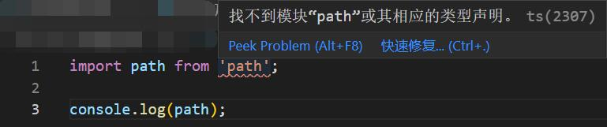

001 - 初始化 TypeScript
===

> Create by **jsliang** on **2022-02-11 08:56:44**  
> Recently revised in **2022-02-11 08:56:44**

* 初始化仓库：`npm init --yes`

> 如果 `package.json` 与 **jsliang** 不同，可能是我使用了 `npm init`，注意 `scripts` 和 `package` 即可，其他可有可无

```json
{
  "name": "feedback",
  "version": "1.0.0",
  "description": "jsliang 打造的一个简陋版客服系统，支持拓展",
  "main": "index.js",
  "scripts": {
    "test": "echo \"Error: no test specified\" && exit 1"
  },
  "keywords": [
    "jsliang",
    "客服系统",
    "乞丐版"
  ],
  "author": "jsliang",
  "license": "MIT"
}
```



```js
找不到模块“path”或其相应的类型声明。ts(2307)
```

---

**不折腾的前端，和咸鱼有什么区别！**

觉得文章不错的小伙伴欢迎点赞/点 Star。

如果小伙伴需要联系 **jsliang**：

* [Github](https://github.com/LiangJunrong/document-library)

个人联系方式存放在 Github 首页，欢迎一起折腾~

争取打造自己成为一个充满探索欲，喜欢折腾，乐于扩展自己知识面的终身学习横杠程序员。

> jsliang 的文档库由 [梁峻荣](https://github.com/LiangJunrong) 采用 [知识共享 署名-非商业性使用-相同方式共享 4.0 国际 许可协议](http://creativecommons.org/licenses/by-nc-sa/4.0/) 进行许可。<br/>基于 [https://github.com/LiangJunrong/document-library](https://github.com/LiangJunrong/document-library) 上的作品创作。<br/>本许可协议授权之外的使用权限可以从 [https://creativecommons.org/licenses/by-nc-sa/2.5/cn/](https://creativecommons.org/licenses/by-nc-sa/2.5/cn/) 处获得。
