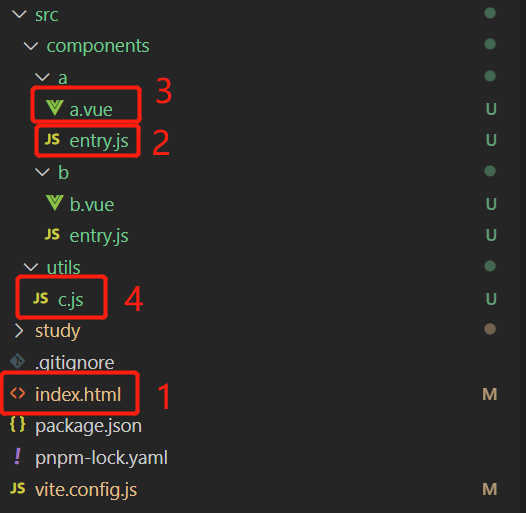
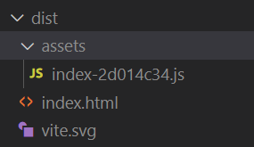
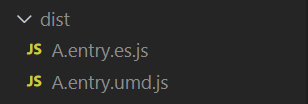
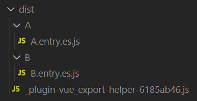

迁移 Vue v2.x 版本到 Vite
===

> Create by **jsliang** on **2023-01-28 08:36:31**  
> Recently revised in **2023-01-28 08:36:31**

## 前言

## 快速入门

下面我们将通过 Vite 进行多入口多出口的打包。

### 步骤一：创建项目

* 安装 PNPM：`npm i pnpm -g`
* 通过 PNPM 创建 Vite + Vue 项目：`pnpm create vite jsliang-plugin --template vue`
  * 创建 Vite 项目：`pnpm create vite`
  * 创建 Vite + Vue TypeScript 项目：`pnpm create vite jsliang-vue-plugin --template vue-ts`

### 步骤二：初始化并运行

* 安装 node_modules：`pnpm i`
* 运行项目：`pnpm run dev`


如图所示打开 `http://127.0.0.1:5173/` 即可，效果如图所示：


如果需要外部可访问的话，需要加上 `--host`，即：

> package.json

```diff
"scripts": {
-  "dev": "vite",
+  "dev": "vite --host",
  "build": "vite build",
  "preview": "vite preview"
},
```

### 步骤三：修改端口

一般 Vite + Vue 提供的端口是 `5173`，像我这么靓的靓仔，肯定要 `1234`。

那就直接修改 `vite.config.js` 吧：

> vite.config.js

> 为避免代码臃肿，第一次提的时候会写全代码，后面会写改动位置

```diff
import { defineConfig } from 'vite'
import vue from '@vitejs/plugin-vue'

// https://vitejs.dev/config/
export default defineConfig({
  plugins: [vue()],
+  server: {
+    port: 8888,
+  },
})
```

### 步骤四：清场搞事

该做的事我们都做了，下面我们把 `src` 目录下所有代码删除，留下一个干净的 Vue 仓库。

并依据下图创建文件夹及其文件



我们代码的调用思路如上图所示。

1. 先调用 `index.html`
2. 再走 `a/entry.js` 或者 `b/entry.js`
3. 接着走 `a/a.vue` 或者 `b/b.vue`
4. 最后走 `utils/c.js` 这个公共模块

### 步骤五：补充代码

下面我们补充代码，使其最终展示如下：


**首先**，我们修改 `index.html`，使其提供了一个类 `jsliang`，其中有一个方法 `addPlugin` 提供注入 HTML 的能力。

> index.html

```html
<!DOCTYPE html>
<html lang="en">
  <head>
    <meta charset="UTF-8" />
    <link rel="icon" type="image/svg+xml" href="/vite.svg" />
    <meta name="viewport" content="width=device-width, initial-scale=1.0" />
    <title>Vite + Vue</title>
    <script>
      class jsliang {
        addPlugin({ pluginName, pluginObj }) {
          const div = document.createElement('div');
          div.classList.add('container');
          div.innerHTML = `
            <div>插件 ${pluginName} 加载成功：</div>
          `;
          document.body.appendChild(div);
          document.body.appendChild(pluginObj());
        }
      }
      window.jsliang = new jsliang();
    </script>
  </head>
  <body>
    <div id="app"></div>
    <script type="module" src="/src/components/a/entry.js"></script>
    <script type="module" src="/src/components/b/entry.js"></script>
  </body>
</html>
```

**然后**，我们这里引用了 2 个入口（因为是测试的，所以直接在 `pnpm run dev` 模式上测试）

> src/components/a/entry.js

```js
// 这里引用了 a.vue 的代码
import A from './a.vue';

(function() {
  console.log('jsliang 插件加载成功');

  window.jsliang && window.jsliang.addPlugin && window.jsliang.addPlugin({
    pluginName: 'jsliang',
    pluginObj: A.methods.renderDOM,
  });
})();
```

> src/components/a/a.vue

```vue
<template>
  <div id="container">
    Hello jsliang
  </div>
</template>

<script>
// 引用公共模块 C
import { c } from '../../utils/c';

export default {
  name: 'jsliang',
  mounted() {
    c();
  },
  methods: {
    renderDOM: () => {
      const div = document.createElement('div');
      div.innerHTML = 'Hello jsliang';
      return div;
    }
  }
}
</script>

<style scoped>

</style>
```

> src/utils/c.js

```js
export const c = () => {
  console.log('c 模块加载');
};
```

同此，`src/components/b/entry.js` 和 `src/components/b/b.vue` 同上面代码。

### 步骤六：库模式单入口单出口打包

我们需要完成的最终目标是：**多入口多出口打包**。

当前，我们执行 `pnpm run build`，产生的打包文件为：



而实际上，我们需要的打包结构（打包成 JS 库）：

```
- dist
  - A
    - A.entry.xxx.js
    - c.xxx.js
  - B
    - B.entry.xxx.js
    - c.xxx.js
```

所以，就需要修改 `vite.config.js`：

> vite.config.js

```js
export default defineConfig({
  // ... 代码省略

  // 打包模式
  build: {
    // 库模式
    lib: {
      // 设置入口文件
      entry: 'src/components/a/entry.js',
      // 打包后的包名称
      name: 'A',
      // 打包后的文件名
      fileName: (format) => `A.entry.${format}.js`,
    }
  }
});
```

**除此之外**，顺带删除项目下 `public` 目录（包含里面的 `vite.svg`，避免打包时参和进来。

此时，我们再次执行 `pnpm run build`，打包内容如下：



从而实现了单入口单出口打包。

### 步骤六：库模式多入口多出口打包

那么，如何进一步完善多入口多出口打包。

```
- dist
  - A
    - A.entry.xxx.js
    - c.xxx.js
  - B
    - B.entry.xxx.js
    - c.xxx.js
```

经过一番折腾，我们修改 Vite 配置如下：

```js
import { defineConfig } from 'vite'
import vue from '@vitejs/plugin-vue'

// https://vitejs.dev/config/
export default defineConfig({
  // 加载插件
  plugins: [vue()],
  // 端口设置
  server: {
    port: 8888,
  },
  // 打包模式
  build: {
    // 库模式
    lib: {
      // 设置入口文件
      entry: {
        'A': 'src/components/a/entry.js',
        'B': 'src/components/b/entry.js'
      },
      formats: ['es'],
      // 打包后的文件名
      fileName: (format, entryName) => `${entryName}/${entryName}.entry.${format}.js`,
    },
  }
});
```

此时打包内容如下：



无疑，这一个打包结果，距离我们差的有点多。

主要问题，出在打包后，公共代码并没有分 2 个文件装到指定文件夹。

关于这个问题，厚颜无耻在 Vite 的 Discussions 上请教大佬：

* [vite lib multiple outputs](https://github.com/vitejs/vite/discussions/11843)

还没得到回复。

于是。

咱就想。

能不能自力更生，先把问题解决再说。


## 迁移 - Vue CLI 方案

## 迁移 - Vite 方案

## 实例

https://github.com/Yumiko-Liu/vue-flat-calendar

## 参考文献

* [Vite Issue - Multiple entry points/output in library mode? #1736](https://github.com/vitejs/vite/discussions/1736)

---

**不折腾的前端，和咸鱼有什么区别！**

觉得文章不错的小伙伴欢迎点赞/点 Star。

如果小伙伴需要联系 **jsliang**：

* [Github](https://github.com/LiangJunrong/document-library)
* [掘金](https://juejin.im/user/3403743728515246)

个人联系方式存放在 Github 首页，欢迎一起折腾~

争取打造自己成为一个充满探索欲，喜欢折腾，乐于扩展自己知识面的终身学习斜杠程序员。

> jsliang 的文档库由 [梁峻荣](https://github.com/LiangJunrong) 采用 [知识共享 署名-非商业性使用-相同方式共享 4.0 国际 许可协议](http://creativecommons.org/licenses/by-nc-sa/4.0/) 进行许可。<br/>基于 [https://github.com/LiangJunrong/document-library](https://github.com/LiangJunrong/document-library) 上的作品创作。<br/>本许可协议授权之外的使用权限可以从 [https://creativecommons.org/licenses/by-nc-sa/2.5/cn/](https://creativecommons.org/licenses/by-nc-sa/2.5/cn/) 处获得。
