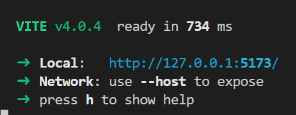
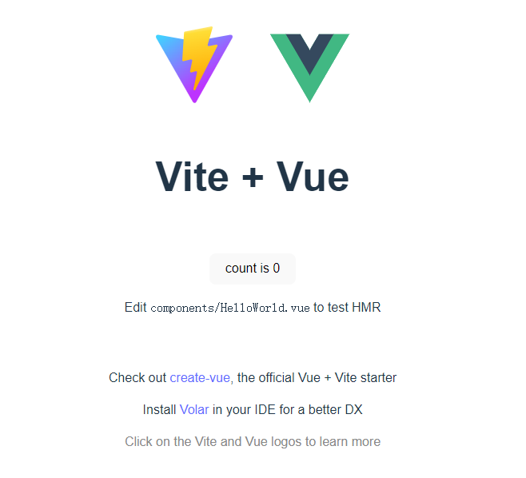

迁移 Vue v2.x 版本到 Vite
===

> Create by **jsliang** on **2023-01-28 08:36:31**  
> Recently revised in **2023-01-28 08:36:31**

## 前言

## 快速入门

下面我们将通过 Vite 进行多入口多出口的打包。

目标为：

**步骤一**：创建项目

* 安装 PNPM：`npm i pnpm -g`
* 通过 PNPM 创建 Vite + Vue 项目：`pnpm create vite jsliang-plugin --template vue`
  * 创建 Vite 项目：`pnpm create vite`
  * 创建 Vite + Vue TypeScript 项目：`pnpm create vite jsliang-vue-plugin --template vue-ts`

**步骤二**：初始化并运行

* 安装 node_modules：`pnpm i`
* 运行项目：`pnpm run dev`



如图所示打开 `http://127.0.0.1:5173/` 即可，效果如图所示：



如果需要外部可访问的话，需要加上 `--host`，即：

> package.json

```diff
"scripts": {
-  "dev": "vite",
+  "dev": "vite --host",
  "build": "vite build",
  "preview": "vite preview"
},
```

**步骤三**：修改端口

一般 Vite + Vue 提供的端口是 `5173`，像我这么靓的靓仔，肯定要 `1234`。

那就直接修改 `vite.config.js` 吧：

> vite.config.js

> 为避免代码臃肿，第一次提的时候会写全代码，后面会写改动位置

```diff
import { defineConfig } from 'vite'
import vue from '@vitejs/plugin-vue'

// https://vitejs.dev/config/
export default defineConfig({
  plugins: [vue()],
+  server: {
+    port: 8888,
+  },
})
```

**步骤四**：清场搞事

该做的事我们都做了，下面我们删除 `src` 目录下所有无用代码，留下一个干净的 Vue 仓库：


## 迁移 - Vue CLI 方案

## 迁移 - Vite 方案

## 实例

https://github.com/Yumiko-Liu/vue-flat-calendar

---

**不折腾的前端，和咸鱼有什么区别！**

觉得文章不错的小伙伴欢迎点赞/点 Star。

如果小伙伴需要联系 **jsliang**：

* [Github](https://github.com/LiangJunrong/document-library)
* [掘金](https://juejin.im/user/3403743728515246)

个人联系方式存放在 Github 首页，欢迎一起折腾~

争取打造自己成为一个充满探索欲，喜欢折腾，乐于扩展自己知识面的终身学习斜杠程序员。

> jsliang 的文档库由 [梁峻荣](https://github.com/LiangJunrong) 采用 [知识共享 署名-非商业性使用-相同方式共享 4.0 国际 许可协议](http://creativecommons.org/licenses/by-nc-sa/4.0/) 进行许可。<br/>基于 [https://github.com/LiangJunrong/document-library](https://github.com/LiangJunrong/document-library) 上的作品创作。<br/>本许可协议授权之外的使用权限可以从 [https://creativecommons.org/licenses/by-nc-sa/2.5/cn/](https://creativecommons.org/licenses/by-nc-sa/2.5/cn/) 处获得。
