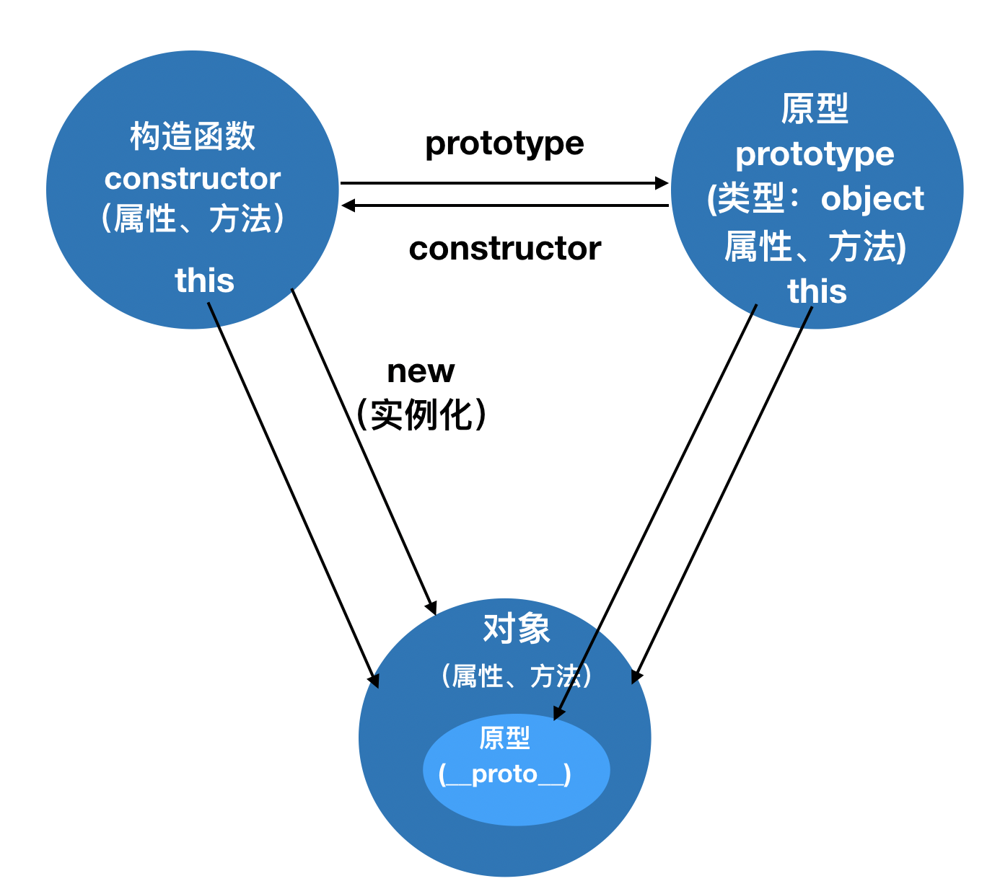

##	面向对象（OOP：Object Oriented Programming）


## 课前准备

- 工具
  - 编辑器 VSCode
  - 浏览器 Chorme
- 前置知识
  - Js基本知识

## 课堂主题

- 对象的创建
- 工厂模式
- new运算符

- 构造函数

- 原型prototype

- 构造函数继承

-  原型的继承

- 原型链
- 包装对象
- 面相对象和面相过程编程

- 类和对象概念

## 课堂目标

- 理解面相对象思想
- 会使用工厂模式
- 会使用new运算符
- 会使用构造函数
- 理解原型
- 理解原型链
- 会使用继承
- 理解类和对象
- 包装对象


### 面向对象编程思想

 一、面相过程：注重解决问题的步骤，分析问题需要的每一步，实现函数依次调用；

 二、面相对象：是一种程序设计思想。将数据和处理数据的程序封装到对象中；

 三、面相对象特性： 抽象、 继承、封装、多态

优点：提高代码的复用性及可维护性；

​	

##对象

Javascript 是一种基于对象的语言，几乎所有东西都是对象；

1、对象创建方法：

- 字面量创建

- new Object()创建

- Object.create()创建：创建对象的原型；

  

## 工厂模式

一、工厂模式

工厂模式解决了代码复用的问题；

### 对象和类

​	一、对象：具体的某个事物；(如：小明、叮当猫)

​	二、类：一类事物的抽象；(如：人类、猫类)


##new运算符

- new的特点：1.new执行函数 2.自动创建空对象； 3.this绑定到空对象；4 隐式返还this；5.
- 通过new来改造工厂模式

##构造函数

- 构造函数要通过new来调用 this指向实例化对象
- 约定俗成构造函数首字母大写
- 静态属性及方法
  - 静态方法里的this；

##构造函数性能

- 公共空间存放公共方法

##构造函数原型

### prototype原型

- 通过new实例化出来的对象其属性和行为来自两个部分，一部分来自构造函数，另一部分来自原型。
- 当声明一个函数的时候，同时也申明了一个原型 。
- 原型本身是一个对象。
- 对象属性方法查找规则；


### 原型构造函数及对象关系




### 


### 工厂模式对比构造函数

1.但是却没有解决对象识别的问题。即创建的所有实例都是Object类型。(不清楚是哪个对象的实例)

2.没有原型，占用内存。


### 原型链

对象之间的继承关系，在JavaScript中是通过prototype对象指向父类对象，直到指向Object对象为止，这样就形成了一个原型指向的链条，称之为原型链；

1.当访问一个对象的属性或方法时，会先在对象自身上查找属性或方法是否存在，如果存在就使用对象自身的属性或方法。如果不存在就去创建对象的构造函数的原型对象中查找 ，依此类推，直到找到为止。如果到顶层对象中还找不到，则返回 undefined。

2.原型链最顶层为 Object 构造函数的 prototype 原型对象，给 Object.prototype 添加属性或方法可以被除  null 和 undefined 之外的所有数据类型对象使用。


### 构造函数继承

- 继承：子类继承父类所有属性和行为，父类不受影响。
- 目的：找到类之间的共性精简代码

```js
function Person(name){
    this.name = name;
    this.eyes = "两只";
    this.legs = "两条";
}
function Student(name){
    Person.call(this,name)
    this.className = "二班";
}
let newPerson = new Student("张三");
console.log(newPerson.className);
```


- 简单原型继承,出现影响父类的情况；

  ```js
  function Person(name){
      this.name = name;
      this.eyes = "两只";
      this.legs = "两条";
  }
  function Student(name){
      Person.call(this,name)
      this.className = "二班";
  }
  Student.prototype = Person.prototype  //直接赋值
  ```


### 原型的深拷贝继承

- 传值和传址问题

  - 基本数据类型：Number、String、Boolean、Null、Undefined
  - 复杂数据类型/引用数据类型:Array、Date、Math、RegExp、Object、Function等

- JOSN序列化的不足

  ```
  如果拷贝对象包含函数，或者undefined等值，此方法就会出现问题
  ```

- 浅拷贝和深拷贝

  ```js
  //递归深拷贝
  function deepCopy(obj){
      let newObj = Array.isArray(obj)?[]:{};
      for(let key in obj){
          if(obj.hasOwnProperty(key)){
              if(typeof obj[key] == "object"){
                  newObj[key] = deepCopy(obj[key]);
              }else{
                  newObj[key] = obj[key];
              }
          }
      }
      return newObj;
  }
  ```


###原型的继承

- 深拷贝继承

- 组合继承

  ```js
  function Dad(){
      this.name = "张三";
  }
  Dad.prototype.hobby = function(){
      console.log("喜欢篮球");
  }
  function Son(){
      Dad.call(this);
  }
  let F = function(){}
  F.prototype = Dad.prototype;
  Son.prototype = new F();
  Son.prototype.constructor = Son;
  
  let newSon = new Son();
  newSon.hobby();
  ```

  ### 包装对象
  
  - 除过null,undefined，基本类型都有自己对应的包装对象：String Number Boolean 	
  - 包装对象把所有的属性和方法给了基本类型，然后包装对象消失

## 总结

​    1）面向对象编程

​	2）工厂模式

​	3）new运算符

​	3）构造函数

​	4）原型

​	5）面相对象和面相过程编程

​	6）类和对象


## 作业 && 答疑

复习相关内容


